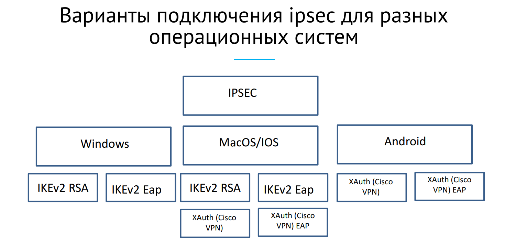
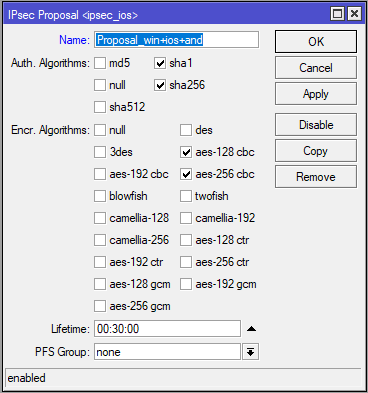

# IPsec.
- [Policies](#Policies)
- [Proposals](#Proposals)
- [Groups](#Groups)
- [Peers](#Peers)
- [Identites](#Identites)
- [Profiles](#Profiles)
- [Active Peers](#Active)
- [Mode Configs](#Mode)
- [Installed SAs](#Installed)
- [Keys](#Keys)
 
## Policies
Таблица политик используется для определения того, должны ли параметры безопасности применяться к пакету. 
## Proposals
Информация о предложении, которая будет отправлена ​​демонами IKE для установления SA для определенной политики. 
 
**Auth.Algorithms:** - Разрешенные алгоритмы авторизации. 
**Encr.Algorithms:** - Разрешенные алгоритмы шифрования. 
**Lifetime:** - Время жизни ключа(крипто-период). 
**PFS-Group:** - Совершенная прямая секретность (англ. Perfect forward secrecy) [Подробнее](https://ru.wikipedia.org/wiki/Perfect_forward_secrecy)
## Groups
В этом меню можно создать дополнительные группы политик, используемые шаблонами политик. 
## Peers
Настройки одноранговой конфигурации используются для установления соединений между демонами IKE. Затем это соединение будет использоваться для согласования ключей и алгоритмов для SA. Режим обмена является единственным уникальным идентификатором между одноранговыми узлами, что означает, что может быть несколько одноранговых конфигураций с одним и тем же удаленным адресом, если используется другой режим обмена . 
## Identites
Идентификаторы - это параметры конфигурации, специфичные для удаленного узла. Основное назначение идентификатора - обрабатывать аутентификацию и проверять целостность партнера. 
## Profiles
Профили определяют набор параметров, которые будут использоваться для согласования IKE на этапе 1. Эти параметры могут быть общими с другими одноранговыми конфигурациями. 
## Active Peers
Это меню предоставляет различную статистику об удаленных узлах, которые в настоящее время установили соединение фазы 1. 
## Mode Configs
В этом меню настраиваются атрибуты конфигурации ISAKMP и IKEv2. 
## Installed SAs
Это меню предоставляет информацию об установленных ассоциациях безопасности, включая ключи. 
## Keys
В этом меню перечислены все импортированные открытые и частные ключи, которые можно использовать для одноранговой аутентификации. Меню имеет несколько команд для работы с клавишами. 