# MikroTik.
- [Сброс](#Сброс)
- [Cетевой мост](#bridge)
- [DHCP Server](#Server)
- [Wi-Fi](#Wi-Fi)
- [Маршрутизация](#Маршрутизация)
- [DNS](#DNS)
- [Обновление Offline](#Offline)
- [Обновление Online](#Online)
- [VLAN](#VLAN)
## Сброс.
Сбрасываем конфигурацию в ноль. <br>
```
System => Reset Configuration => [V]No Default Configuration => [Reset Configuration] => [Yes]
```
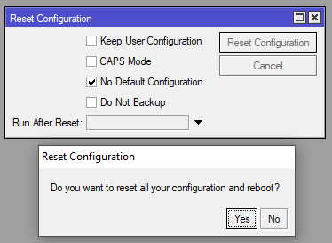<br>
## Bridge.
Создаем сетевой мост по умолчанию. <br>
```
Bridge => Bridge => [+] => [OK]
```
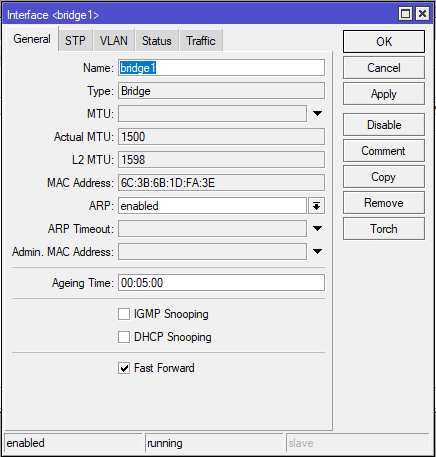<br>
Добавляем в него все локальные интерфейсы.<br>
```
Bridge => Ports => [+] => General => Interface: <interface> => [OK]
```
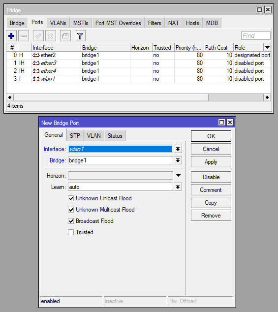<br>

## DHCP.
### Server
Проверяем что у нас есть IP-адрес на интерфейсе с которого мы собираемся слушать дисковер запросы(раздавать адреса).<br>
(Если нет, то добавляем) <br>
```
IP => Addresses => [+]
```
.png)<br>

Создаём пул адресов для DHCP. <br>
```
IP => Pool => [Pools] => [+]
```
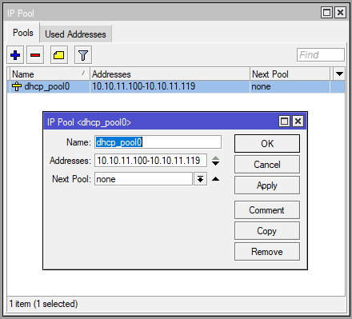<br>

Задаём основные настройки сети.

```
IP => DHCP Server => [DHCP] => [Networks] => [+]
```

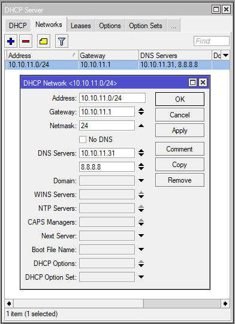<br>

Создаем DHCP Server.

```
IP => DHCP Server => [DHCP] => [+]
```

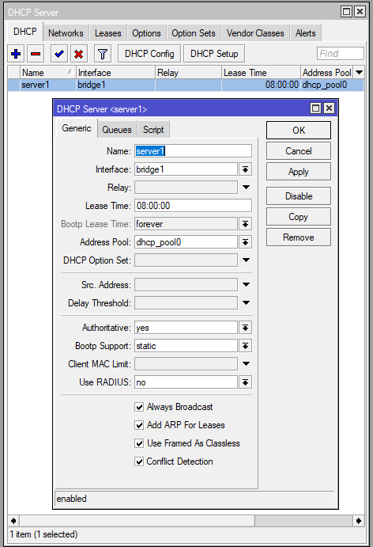<br>

## Wi-Fi.

Открываем стандартный "Security Profile" выбираем шифрование (WPA2 PSK) и придумываем пароль (WPA2 Pre-Shared Key:).<br>
```
Wireless => [Security Profiles] => 'default' => [General]
```
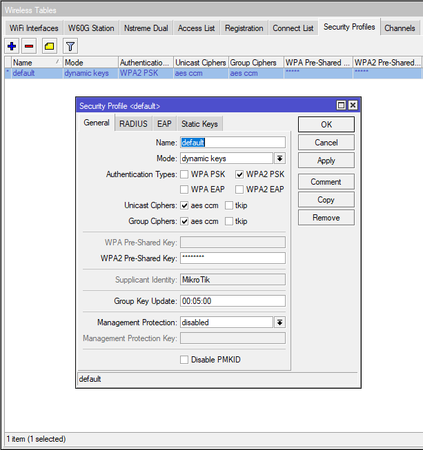<br>

Настраиваем Wi-Fi интерфейс как точку доступа. <br>
```
Wireless => [WiFi Interfaces] => 'wnan0 или wlan1' => [Wireless]
```
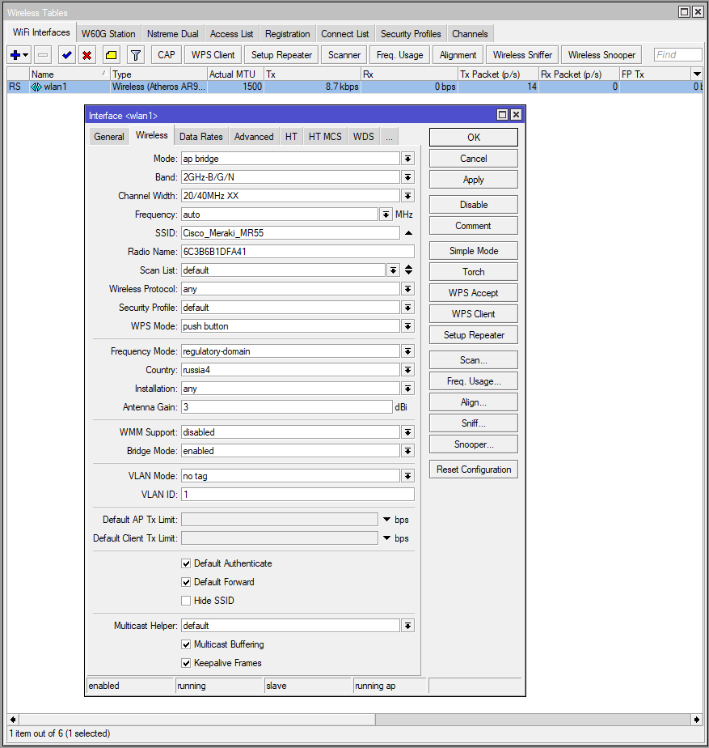<br>

## Маршрутизация.
Добавляем  маршрутизатор по умолчанию(если нет)<br>
```
IP => Routes => [Routes] => [+] => [General]
```
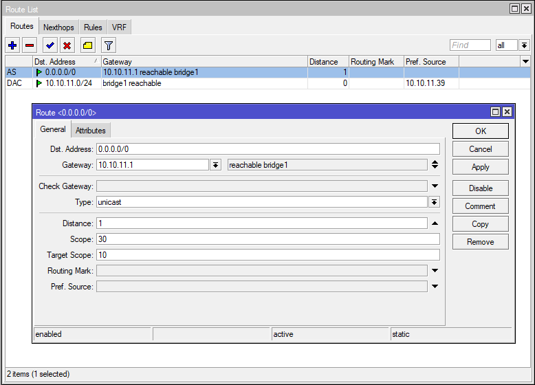<br>
проверяем в терминале(для приостановки пинга <Ctrl+c>). <br>
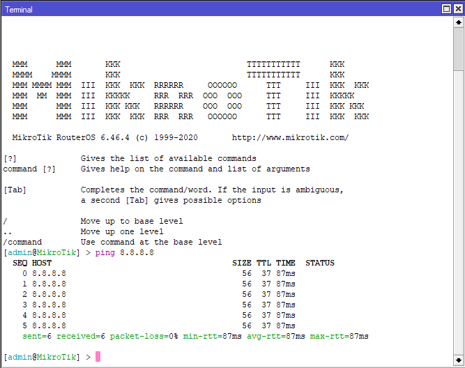<br>
## DNS.
```
IP => DNS
```
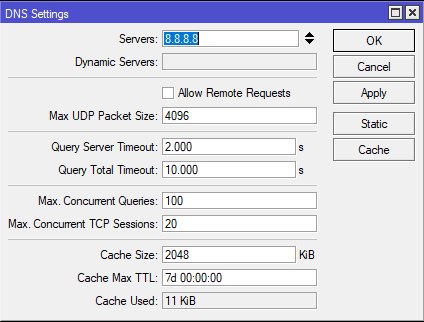<br>
проверяем в терминале(для приостановки пинга <Ctrl+c>). <br>
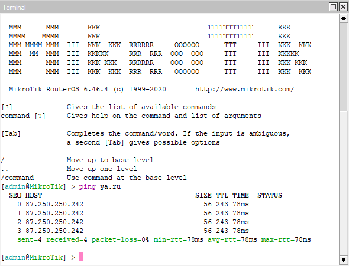<br>
## Обновление.
### Offline

Смотрим платформу вашего железа.
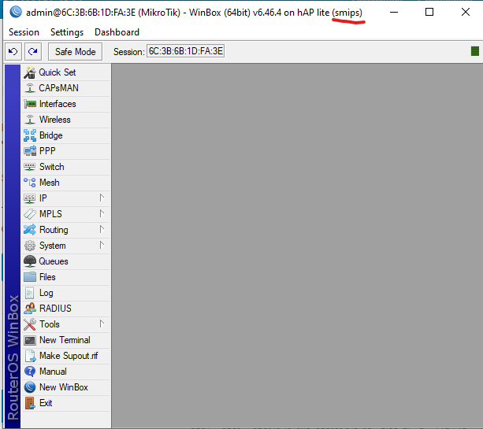<br>
И версию ОС.
```
System => Routerboard
```
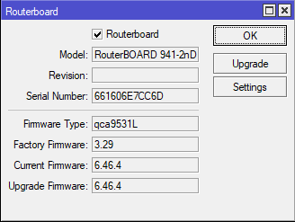<br>
Ходим на сайт https://mikrotik.com/download и скачиваем понравившуюся прошивку.<br>
(если не какая не нравится, а обновить хочется, то качай: Long-term - Main package, не ошебешся)<br>
открываем Files перетакиваем туда образ. <br>
перезагружаем ОС<br>
```
System => Reboot => [Yes]
```
Надеемся что после обновления не чего не отъедет(особенно при обновлении на Testing или Development). <br>
## Безопасность.
### IP => Services
Отключаются все не используемые сервисы. <br>
Во все используемые, добавляем <Available From> <br>
### L2 open ports
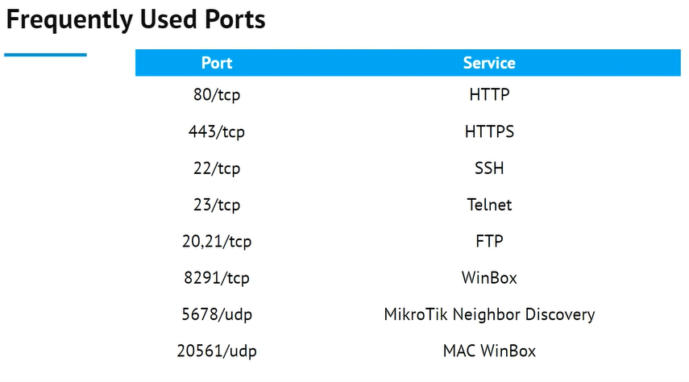<br>
IP => Neighbors => Discovery Settings => interface: [!] [WAN] => [OK]<br>
### IPv6

### Online
```
Quick Set => [Check For Updates] => Channel: <long term или stable> => Download&Install
```
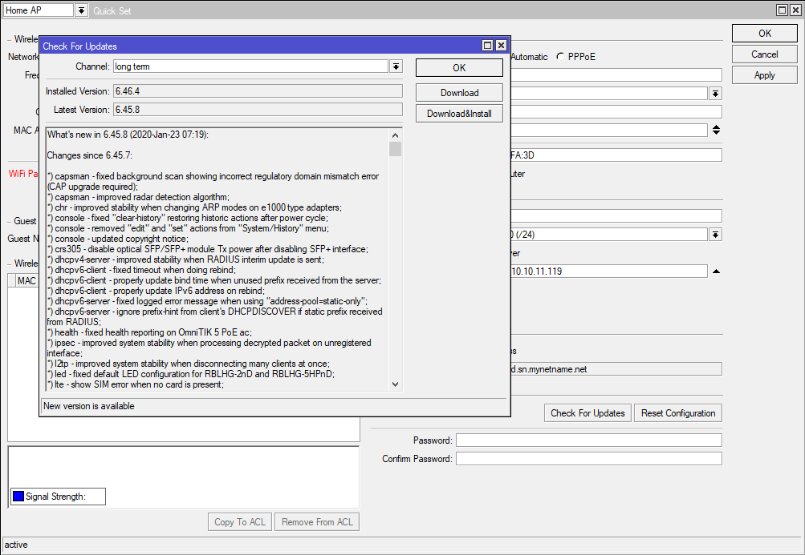<br>

## VLAN
Управлять VLAN`ами можно двумя спосабоми, на основе интерфейсов и на основе мостов, <br>
так как на основе интерфейсов, становится неудобно настроивать уже от 3 VLAN и более, <br>
настраиваем на основе мостов, создаём мост и говорим смотреть на метки.
```
Bridge => Bridge => [+] => [VLAN] => "[V] VLAN Filtring"
```
в созданный мост добавляем порты на которых будут использоватся VLAN <br>
```
Bridge => Ports => [+]
```
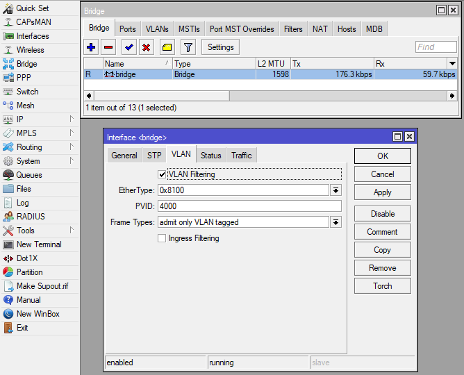<br>
#### Fork + Git
    1. создаём локальную папку репозитория. (не забываем про General settings).
    2. Fork, инициализируем локальный репозиторий(из пункта 1).
    3. создаём внешний репозиторий(git).
    4. Fork, инициализируем внешний репозиторий(из пункта 3).
    5. создаём 'readme.md'
    6. создаём коммит 'init: master' и пушим изменения.(master ветка создана локално и origin).
    7. инициализируем 'git flow'.
    8. переходим в ветку 'develop'.
    9. пишем название проекта(или что угодно) в 'readme.md'.
    10. создаём коммит 'init: develop' и пушим изменения.(develop ветка создана локално и origin).
    11. создаём ветку 'feature/govnokod', и начинаем творить(по возможности пишем: локоничные 'коммиты' и исчерпывающие 'дискрипшены').
